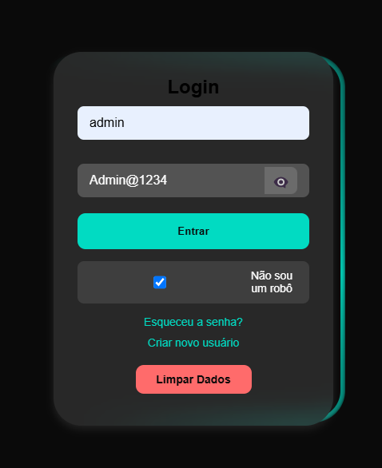
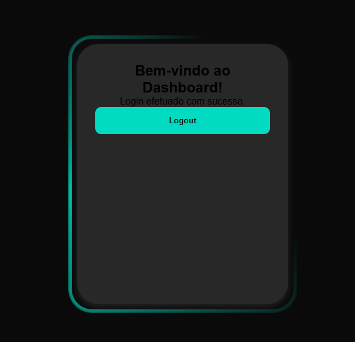

Bank-login-app


Este projeto simula um processo de autenticação simples, em que o usuário pode fazer login em um banco fictício. A aplicação é composta por uma tela de login, um sistema de autenticação utilizando armazenamento local e um dashboard de boas-vindas para usuários autenticados. O design moderno utiliza animações e efeitos interativos para uma experiência visual imersiva.

## Tecnologias Utilizadas

- **HTML5**: Estruturação semântica da página e dos formulários, garantindo acessibilidade e boas práticas de SEO.
- **CSS3**: Estilos responsivos, design moderno com **backdrop-filter** e animações (incluindo a animação de cobrinha no fundo da tela).
- **JavaScript**: Manipulação do DOM, controle de autenticação (armazenamento no Local Storage) e funcionalidades interativas.
- **Local Storage**: Armazenamento de token de autenticação para persistência de sessão do usuário entre recarregamentos da página.

## Funcionalidades

- **Tela de Login**: O usuário pode inserir seu nome de usuário e senha para realizar o login. A tela inclui um campo de captcha para garantir que não é um bot.
- **Exibição de Erros**: Mensagens de erro são exibidas quando há entradas inválidas ou incompletas, como um nome de usuário ou senha incorretos.
- **Animação Interativa**: Uma animação de "cobrinha" gira no fundo da tela, dando um toque moderno e interativo ao design.
- **Dashboard**: Após a autenticação, o usuário é redirecionado para um painel de controle que exibe uma mensagem de boas-vindas: "Login efetuado com sucesso".
- **Logout**: O usuário pode sair clicando no botão "Logout", sendo redirecionado de volta à tela de login.
- **Limpeza de Dados**: Existe um botão para limpar os dados inseridos no formulário de login, útil durante testes ou utilização da aplicação.

## Imagens do Projeto

### Tela de Login


### Tela do Dashboard


## Estrutura do Projeto


/loginfront
│
├── index.html # Página de login
├── dashboard.html # Página de dashboard (após login)
├── style.css # Arquivo de estilos CSS
├── auth.js # Lógica de autenticação (verificação de login)
└── script.js # Lógica do formulário e funcionalidades gerais


## Instalação

Para rodar este projeto localmente, siga os passos abaixo:

1. Clone o repositório para sua máquina local:
   ```bash
   git clone https://github.com/Tatianakami/loginfront.git

cd loginfront

Abra o arquivo index.html no seu navegador preferido.

Faça um fork deste repositório.

Crie uma branch para sua feature:

bash
Copiar
Editar
git checkout -b feature/nome-da-feature
Faça suas alterações e adicione os arquivos modificados:

bash
Copiar
Editar
git add .
Faça commit das suas alterações:

bash
Copiar
Editar
git commit -m 'Adiciona nova funcionalidade'
Envie a branch para o repositório remoto:

bash
Copiar
Editar
git push origin feature/nome-da-feature
Abra um Pull Request.


Essas alterações adicionam a senha "Acesso: admin - Admin@1234" como uma forma de autenticação e protegem o acesso ao dashboard. Se precisar de mais alguma ajuda com a implementação ou ajustes, só avisar!

Licença
Este projeto está licenciado sob a licença MIT - veja o arquivo LICENSE para mais detalhes.

Obrigado por conferir o projeto! 😊


